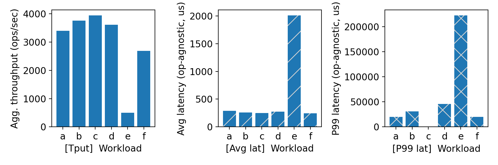
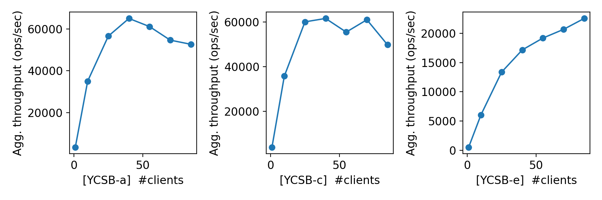
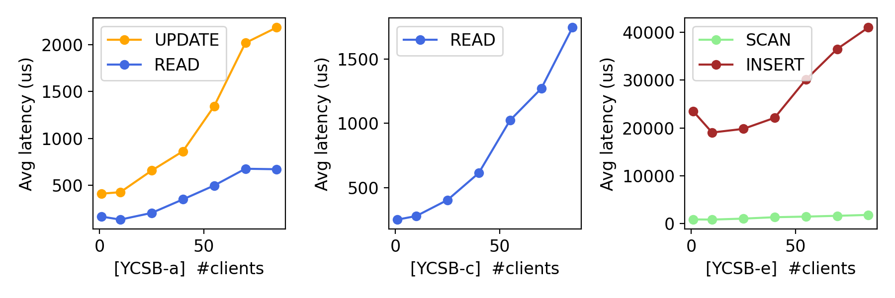

# CS 739 MadKV Project 1

**Group members**: Prasanna Konyala `skonyala@wisc.edu`, Sanjana Kallingal `kallingal@wisc.edu`

## Design Walkthrough

We implemented a client-server based key value store using Java and gRPC. We chose gRPC to handle remote procedure calls between the client and server. The server logic resides in the KVServer class, while the client logic is handled by the KVClient class. 

We defined our RPC interface using a .proto file. The proto file contains all the request and response message formats, along with the service definitions. The services we implemented are: PUT, GET, DELETE, SWAP, and SCAN. The STOP command is handled at the client side to terminate stdin processing.

On the server side, we implemented a KVServer class that extends the generated gRPC service base class and overrides all RPC methods. Each method follows the behavior specified in the Canvas description. The server maintains an in-memory data structure to store key-value pairs and handles incoming RPC requests from multiple clients. We used concurrentSkipListMap structure in java as the kv-store data structure since it stores the keys in a sorted order and is thread safe. The server handles multiple concurrent client requests efficiently by using a cached thread pool for request processing. 

On the client side, we implemented a KVClient class. The client connects to the server using a gRPC stub and listens to standard input for workload commands. We parse each input line and use a switch-case block to call the corresponding RPC stub method. After each operation, the client prints the output strictly in the required stdin/stdout format so that automated testing, fuzzing, and benchmarking work correctly.

## Self-provided Testcases

<u>Found the following testcase results:</u> 1, 2, 3, 4, 5

You will run some testcases during demo time.

### Explanations

We implemented five test cases to demonstrate correctness, concurrency behavior, and handling of edge cases. The test cases follow the required stdin/stdout interface and are runnable through the provided just p1::testcase 1-5 <server-address>.

Case 1:Single Client (All operation + Edge Cases)
This test covers all operations: PUT, GET, SWAP, DELETE, and SCAN. It checks overwrites, missing keys, repeated deletes, and range scans on sorted keys. This verifies basic correctness and expected return values.

Case 2: Single Client (Ordering + Scan Behavior)
This test focuses on lexicographic ordering in SCAN, overwrite chains, and empty ranges.
It ensures keys are returned in sorted order and updates/deletes are reflected immediately.

Case 3 – Concurrent(2 Clients), No Conflicts
Two clients operate on disjoint key spaces(a_* and b_*). We use a_1, a_2 for client 1 and b_1,b_2 for client to avoid conflicts. This validates that concurrent operations on different keys which do not interfere and the system remains stable under parallel execution.

Case 4 – Concurrent(2 clients), Conflicting Keys
Two clients operate on shared keys (shared, counter). This tests interleaving updates and ensures acknowledged writes are visible to other clients without corrupting state.

Case 5 – Concurrent(3 Clients) Write/Delete/Scan Race
Three clients perform writes, deletes, swaps, and scans on overlapping keys. This tests concurrency behavior and ensures scans and reads observe a consistent state even.

## Fuzz Testing

<u>Parsed the following fuzz testing results:</u>

num_clis | conflict | outcome
:-: | :-: | :-:
1 | no | PASSED
3 | no | PASSED
3 | yes | PASSED

You will run a multi-client conflicting-keys fuzz test during demo time.

### Comments

We ran fuzz testing to validate correctness using randomized workloads and concurrent execution. The fuzz tester automatically generates random sequences of KV operations and checks consistency.

We executed the following configurations as mentioned:

1. Single Client (No Conflict) (just p1::fuzz 1 no)
This runs randomized operations with one client. It verifies that the basic logic of the KV store works correctly across many random operation calls without crashing or producing inconsistent results.

2. Three Clients, Disjoint Keys (just p1::fuzz 3 no)
Three clients run concurrently but operate on different key ranges. This tests thread-safety and ensures concurrent execution does not cause unexpected interference or data corruption.

3. Three Clients, Conflicting Keys (just p1::fuzz 3 yes)
Multiple clients operate on overlapping keys. This stresses concurrency handling and validates that acknowledged operations become visible correctly across clients. It also checks that the system maintains consistent behavior under interleaving updates.

All fuzz tests completed successfully without crashes or consistency violations, which gives confidence in the correctness and concurrency safety of our implementation with Java's ConcurrentSkipListMap data structure as the KV-Store.

## YCSB Benchmarking

<u>Single-client throughput/latency across workloads:</u>

<u>Agg. throughput trend vs. number of clients:</u>

<u>Avg. latency trend vs. number of clients:</u>

### Comments

We ran YCSB workloads A, C, and E with 10, 25, 40, 55, 70, and 85 concurrent clients to evaluate scalability and performance behavior of our KV store.

Workload A (Balanced Read/Write – 50/50)
Workload A represents a balanced mix of reads and updates. From the plot, throughput increases as the number of clients increases initially, showing that the system benefits from parallelism. However, after a certain point, the throughput growth slows down and begins to plateau. This behavior is expected because higher concurrency increases thread contention and CPU usage. As more clients compete for shared data structures and thread pool resources, the server approaches its capacity limit. Therefore the primary bottleneck is context switching

Workload C (Read-Only – 100% Reads)

Workload C is read-only. This workload scales better than Workload A because reads do not modify state and generally require less synchronization overhead. The throughput increases more steadily compared to the balanced workload. At higher client counts, performance eventually stabilizes due to CPU saturation and scheduling overhead, but it still performs better than write-heavy workloads.
The eventual stabilization is mostly due to the CPU bottleneck. We used nodes with 32 cores. The cores are likely maxed out just parsing gRPC Protobuf messages and handling the massive flood of incoming traffic from 85 clients.

Workload E (Scan-Heavy)

Workload E includes scan operations, which are more expensive than simple reads or writes. From the plot, throughput increases with more clients but at a slower rate compared to Workloads A and C. Scan operations require iterating over a range of keys, which increases CPU work per request. As concurrency increases, the system experiences more contention during range scans, leading to earlier performance saturation compared to pure reads.
In the concurrentSkipListMap structure, the worker threads have to walk through a whole range of keys in the data structure, which is much more CPU-intensive per request.

## Additional Discussion
### Issues with YCSB Benchmark Tests timeout with > 40 clients
When we weren't using the newCachedThreadPool on the server side, the server relied on a fixed number of threads internally configured by grpc, which created a massive bottleneck. With 85 clients hitting a 32-core machine, there simply weren't enough threads to go around. Most of our clients were stuck in a long queue, waiting for a thread to become free just so they could start their request. Because operations like SCAN take longer to finish, the queue moved too slowly, and the clients eventually gave up and timed out before the server even looked at their request.

Switching to newCachedThreadPool solved this by letting the server be much more flexible. Instead of forcing clients to wait in a line, it spun up a new thread for every single connection. This meant all 85 clients could "talk" to the server at the exact same time. Even though we only have 32 physical cores, the operating system was able to rapidly swap between all those threads so that every client felt like they were making progress. This kept the communication lines open and prevented the "dead silence" that was causing the benchmark timeouts. Although, because of 85 new threads spun up, the primary bottleneck should be mostly because of the context switching between these threads.

### Java Heap Memory at 128MB survived the benchmark test
We honestly didn't need a huge heap because our code doesn't "hoard" data. Since we used the onNext() function to stream our SCAN results, we were basically pushing data out of the server as fast as we were finding it. As soon as a response was flushed to the client, those objects were quickly deleted by the JVM. This high turnover kept our memory usage totally flat. We never hit a point where the garbage collector has to panic and freeze the whole system to find space, which is why we stayed fast even with 85 clients hammering a tiny 128MB limit.

## AI Tools Disclosure
### Navigate new information and concepts
We initially used **Gemini** to gain a better context of the project since there was an overwhelming amount of information to make sense of.This was particularly helpful for understanding the gRPC lifecycle and learning how to correctly trigger code generation for our Java files within the Gradle environment. Gemini also served as a guide for navigating and configuring our CloudLab instances during the early experimentation phase.

Once we setup the base project structure within the project directory (kvstore), we were able to quickly implement the codebase without any AI tools. The implementation mainly just involved overwriting the generated function by gRPC.

### Debugging Codebase
At several points in the project, we encountered failures. Main ones being

- YCSB Benchmark Interfacing & Timeouts
We initially found that the YCSB benchmark tool was failing to read our client outputs, leading to consistent timeouts. We discovered this was caused by invoking the client through Gradle, which injected its own logging statements into the terminal. These extra logs inserted/appended with the standard output made it impossible for the benchmark tool to parse the results correctly. Copilot helped us identify this and refine our execution commands to bypass the Gradle middleware when invoking the client node.

- Thread Management with newCachedThreadPool
As our concurrent client load scaled, we encountered performance bottlenecks that were only resolved by implementing a newCachedThreadPool. Copilot helped us integrate this dynamic scaling logic, ensuring the server could spin up threads on demand for all 85 clients without hitting the queue limits that were previously causing our benchmarks to hang.

